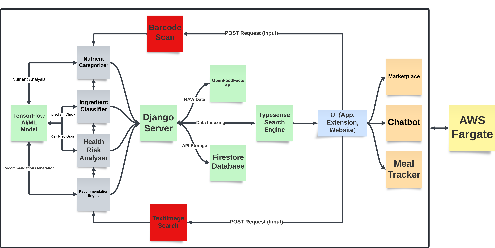

  

## Project Description

The app supports barcode scanning for foods, drinks, cosmetics, medicines, and pet foods. It provides detailed ingredient information, categorizes nutrients into positive and negative (either generally or based on user-specific health data), identifies associated health risks, and suggests alternatives using an AI recommendation engine.

### Key Features

- **Search Engine**: Easily find products without barcode scanning, with upcoming support for image and live product recognition.
- **Meal Tracker**: Monitor your daily nutritional intake by scanning product barcodes, allowing you to easily track and manage your meals.
- **Marketplace**: Discover and purchase for healthier alternatives from our trusted partners.
- **Browser Extension**: Integrate app features seamlessly into your online shopping experience.

Additionally, the app includes a Recipe Chatbot for personalized recipe recommendations and an Account Activity feature to track your scan history, searches, and payments.

## Project Overview

  
   
  Flutter Application

---

  
   
  Browser Extension (Content-Script)

---

  
   
  Browser Extension (Popup)

---

  
   
  Website

## System Architecture

  

---

1. **Barcode Scan**: Utilizes the `zxing_flutter` library to capture barcode input from the user via the Flutter app. The scanned barcode is then sent to the Django server for further processing.

2. **Text Search**: Accepts text input from the user through the Flutter app for product lookup. This input is forwarded to the Django server to query the Firestore database for relevant product information.

3. **Django Server**: Serves as the central backend server responsible for user authentication, data cleaning, integration with the Gemini API, and interaction with Google Firebase services.

4. **OpenFoodFacts API**: Fetches raw, detailed information about products based on barcode or text search inputs. This API provides comprehensive ingredient and nutritional data, including metadata such as name, brand, and more.

5. **Gemini API**: Analyzes data from the OpenFoodFacts API, sorting nutrients into positive and negative categories, flagging potential health risks, and offering product recommendations.

6. **Firestore Database**: Stores processed product information, facilitating quick lookups for both the browser extension and the Flutter app. If no barcode is detected, it searches the database for relevant details.

7. **Flutter App**: Cross-platform mobile application enabling users to scan barcodes for offline shopping, access features such as a recipe chatbot, meal tracker for monitoring nutritional intake, and a marketplace for healthy products.

8. **Browser Extension**: Extends the features of the Flutter app to the user's online shopping experience, allowing product lookups using our search engine directly within the browser.

## Contributing

We welcome contributions! Please follow the guidelines in our [Contributing Guide](https://github.com/1MindLabs/mivro-documentation/blob/main/CONTRIBUTING.md) to get started.

## License

This project is licensed under the [MIT License](https://github.com/1MindLabs/mivro-documentation/blob/main/LICENSE).

## Authors

[Areeb Ahmed](https://github.com/areebahmeddd) - [Shivansh Karan](https://github.com/SpaceTesla) - [Shashwat Kumar](https://github.com/shashwat6204) - [Rishi Chirchi](https://github.com/rishichirchi)
